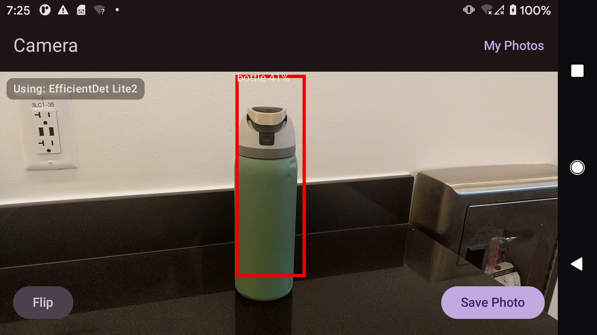
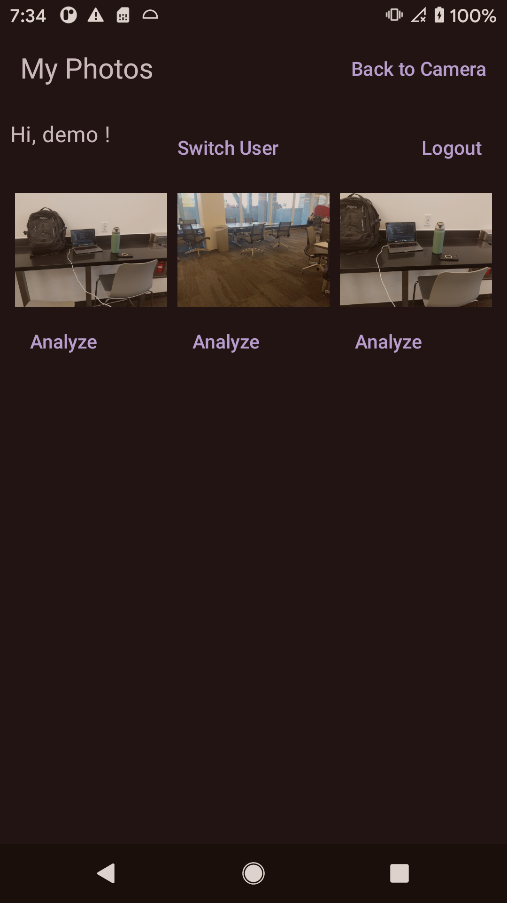
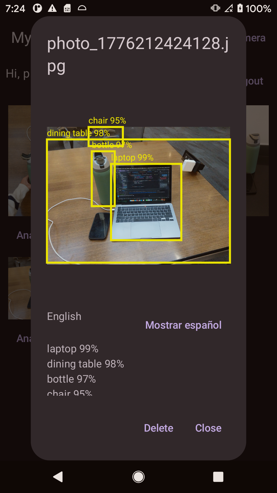
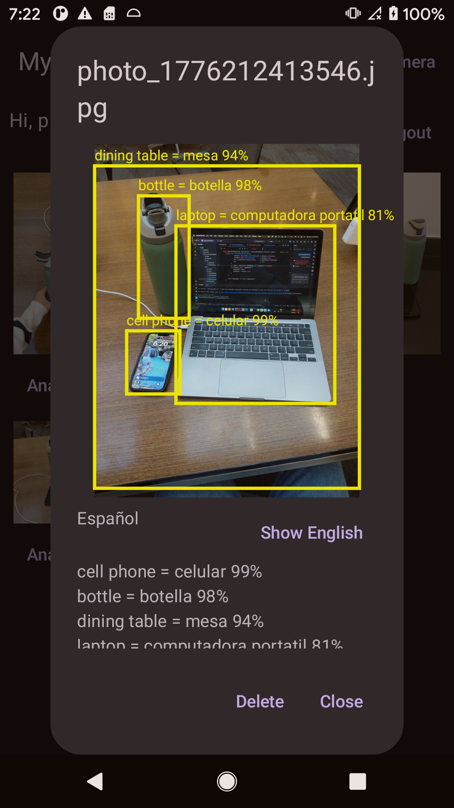

# Augmented Reality Object Detection App

An Android augmented-reality style camera app with real-time object detection, authenticated photo storage, a user gallery, server-side image analysis, and English/Spanish detection labels.

The repository contains two projects:

- `AugmentedReality/` - Android app built with Kotlin, Jetpack Compose, CameraX, TensorFlow Lite, Ktor Client, Coil, and DataStore.
- `ApplicationServer/` - Kotlin/Ktor backend with JWT auth, OpenLDAP user storage, photo upload/download routes, and a Python FastAPI ML service.

## Purpose

The goal of this project is to explore how computer vision and mobile augmented reality can make everyday objects interactive. The app detects objects through the camera, saves photos, analyzes saved images, and displays object names with confidence scores in English or Spanish.

With further development, this could become a practical language-learning app. A user could point their phone at objects around them, see the object name in a target language, hear the pronunciation, save useful examples, and review vocabulary later from their own real-world surroundings.

### Screenshots

Live camera detection highlights objects in real time before the photo is saved.



The gallery keeps saved photos connected to the logged-in user and gives each photo actions like analyze or delete.



Saved photos can be analyzed again from the gallery with object labels, confidence scores, and detection boxes.



Detected labels can be switched between English and Spanish for quick vocabulary practice.



## Capabilities

- Live camera preview with real-time object boxes and confidence labels.
- On-device object detection using TensorFlow Lite EfficientDet Lite2.
- Camera capture with local MediaStore save.
- Login, signup, and logout with JWT authentication.
- LDAP-backed user accounts.
- Photo upload to a Ktor backend.
- Per-user "My Photos" gallery.
- Authenticated gallery image loading.
- Delete uploaded photos.
- Server-side object detection for saved gallery photos.
- Gallery analysis view with the photo, top detection labels, and boxes over the image.
- English/Spanish toggle for analyzed object labels.
- Local development support for both Android emulator and physical USB device.

## Architecture

```text
Android app
  CameraX preview / capture / analysis
  TensorFlow Lite live detection
  Ktor Client API calls
  DataStore JWT session storage
        |
        | HTTP + JWT
        v
Ktor backend
  Auth routes
  Upload/gallery routes
  AI proxy routes
        |
        +--> OpenLDAP for users
        |
        +--> FastAPI ML service for server-side detection
```

## Tech Stack

### Android

- Kotlin
- Jetpack Compose / Material 3
- CameraX
- TensorFlow Lite Task Vision
- EfficientDet Lite2
- Ktor Client
- Coil Compose
- Jetpack DataStore
- Coroutines / StateFlow

### Backend

- Kotlin
- Ktor
- JWT authentication
- OpenLDAP
- Docker Compose
- Python FastAPI ML service
- Hugging Face Transformers object detection model

## Requirements

Install these before running the full project:

- Android Studio
- Android SDK / platform-tools
- JDK 17 or newer
- Docker Desktop
- Git
- A physical Android device or emulator

For physical-device development, USB debugging must be enabled.

## Repository Structure

```text
AugmentedRealityApplication/
├── AugmentedReality/
│   ├── app/src/main/java/com/example/augmentedreality/
│   │   ├── data/              # MediaStore photo saving
│   │   ├── detection/         # Label filtering/aliases
│   │   ├── net/               # API client + token storage
│   │   └── ui/                # Camera and gallery screens
│   └── app/src/main/assets/   # TFLite model goes here
├── ApplicationServer/
│   ├── src/main/kotlin/       # Ktor backend
│   ├── src/main/resources/    # application.conf
│   ├── ml_server/             # FastAPI ML service
│   └── docker-compose.yml
└── README.md
```

## Model File

The Android app requires the EfficientDet Lite2 model file. It is not tracked in Git.

Download it into the Android app assets directory:

```bash
cd AugmentedReality
mkdir -p app/src/main/assets
curl -L "https://storage.googleapis.com/tfhub-lite-models/tensorflow/lite-model/efficientdet/lite2/detection/metadata/1.tflite" \
  -o app/src/main/assets/efficientdet_lite2.tflite
```

## Running Locally

You need one Ktor backend on port `8080`, plus the dependency services.

For active development, the recommended setup is:

```bash
cd ApplicationServer
docker compose up -d openldap ml
./gradlew run
```

This runs:

- OpenLDAP in Docker on port `1389`
- ML service in Docker on host port `8001`
- Ktor locally with Gradle on port `8080`

Do not run the Docker `app` service at the same time as `./gradlew run`, because both use port `8080`.

### Alternative: Run Everything In Docker

If you are not editing the backend and just want the containerized backend stack:

```bash
cd ApplicationServer
docker compose up -d --build
```

In that mode, Docker runs OpenLDAP, ML, and the Ktor app. Do not also run `./gradlew run`.

## Running The Android App

### Android Emulator

The Android app defaults to:

```text
http://10.0.2.2:8080
```

That is the emulator's special address for your host machine.

Install and run:

```bash
cd AugmentedReality
./gradlew installDebug
```

### Physical USB Device

For a physical tethered device, use `localhost` in the app and forward the phone's port `8080` back to your Mac:

```bash
cd AugmentedReality
./gradlew installDebug -PAPI_BASE_URL=http://localhost:8080
```

The Gradle install task attempts to run:

```bash
adb reverse tcp:8080 tcp:8080
```

You can verify it with:

```bash
adb reverse --list
```

Expected output includes:

```text
tcp:8080 tcp:8080
```

## Typical Development Workflow

Terminal 1:

```bash
cd ApplicationServer
docker compose up -d openldap ml
./gradlew run
```

Terminal 2:

```bash
cd AugmentedReality
./gradlew installDebug -PAPI_BASE_URL=http://localhost:8080
```

Then open the app on the phone manually.

## Backend Endpoints

| Method | Path | Auth | Description |
|---|---|---|---|
| `POST` | `/api/user` | No | Sign up |
| `POST` | `/api/auth` | No | Login and receive JWT |
| `GET` | `/api/upload` | Yes | List current user's uploaded photos |
| `GET` | `/api/upload/{filename}` | Yes | Download/view a user photo |
| `POST` | `/api/upload/{filename}` | Yes | Upload a photo |
| `DELETE` | `/api/upload/{filename}` | Yes | Delete a photo |
| `POST` | `/api/ai/detect-bytes` | Yes | Detect objects from uploaded bytes |
| `GET` | `/api/ai/detect-name/{filename}` | Yes | Detect objects in a stored photo |

## Important Local URLs

| Service | URL |
|---|---|
| Ktor backend | `http://localhost:8080` |
| Android emulator backend URL | `http://10.0.2.2:8080` |
| OpenLDAP | `ldap://localhost:1389` |
| ML service from host | `http://localhost:8001` |
| ML service inside Docker network | `http://ml:8000` |

## Auth Notes

- Users are stored in OpenLDAP.
- Login returns a JWT.
- Android stores the JWT and username in DataStore.
- Authenticated routes require:

```text
Authorization: Bearer <token>
```

For local development, JWTs currently last 24 hours.

## Photo And Detection Notes

- Captured photos are saved locally to the device with MediaStore.
- Uploaded photos are stored per user on the backend.
- Live camera boxes use the on-device TFLite model.
- Gallery Analyze boxes use the server-side ML model.
- Because those are different models, the labels/boxes may not be identical between live camera and gallery analysis.
- The ML server applies EXIF orientation before detection so boxes match the displayed gallery image.
- Gallery analysis returns dimensions used during detection so Android can scale boxes onto the displayed image.

## Troubleshooting

### `Address already in use` on `./gradlew run`

Something is already using port `8080`.

Check:

```bash
lsof -nP -iTCP:8080 -sTCP:LISTEN
```

Run either Docker Ktor or Gradle Ktor, not both.

### Signup/Login Fails

Make sure OpenLDAP is running:

```bash
cd ApplicationServer
docker compose ps
```

You should see `openldap` healthy.

### Gallery Analyze Fails

Make sure the ML service is healthy:

```bash
cd ApplicationServer
docker compose ps ml
curl http://localhost:8001/healthz
```

### Physical Phone Cannot Reach Backend

Check USB reverse forwarding:

```bash
adb reverse --list
```

If needed:

```bash
adb reverse tcp:8080 tcp:8080
```

Install with:

```bash
cd AugmentedReality
./gradlew installDebug -PAPI_BASE_URL=http://localhost:8080
```

### Emulator Cannot Reach Backend

Use the default emulator URL:

```text
http://10.0.2.2:8080
```

Install with:

```bash
cd AugmentedReality
./gradlew installDebug
```

## Build Checks

Android:

```bash
cd AugmentedReality
./gradlew :app:compileDebugKotlin
```

Backend:

```bash
cd ApplicationServer
./gradlew compileKotlin
```

Python ML server:

```bash
python3 -m py_compile ApplicationServer/ml_server/main.py
```

## Data That Should Not Be Committed

These are local/generated and should stay out of Git:

```text
ApplicationServer/uploads/
ApplicationServer/ml_server/__pycache__/
AugmentedReality/.idea/
```

## Future Improvements

- Use the same object detection model for live camera and gallery analysis for more consistent labels/boxes.
- Draw saved gallery boxes with better label backgrounds.
- Add a dedicated full-screen photo detail page instead of a dialog.
- Add refresh/pull-to-refresh to My Photos.
- Add token refresh or automatic re-login handling.
- Add production HTTPS configuration.

## Author

Jakob West
